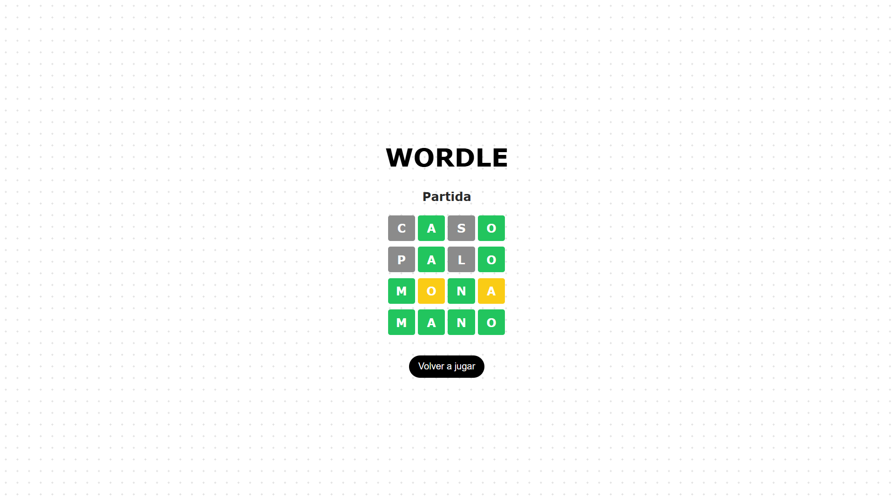

# Wordle – Juego web interactivo de adivinanza de palabras

Aplicación web interactiva inspirada en el juego **Wordle**, replicando sus reglas clásicas y dinámicas principales.
Se desarrolló en **React** y **Typescript**, consumiendo una **API REST** externa para gestionar sesiones, validar palabras y seleccionar entre distintos niveles de dificultad. Se centró en ofrecer una **interfaz atractiva**, **intuitiva** y **responsive**.

### Funcionalidades principales
- Conexión con la API para gestionar sesiones, niveles de dificultad y validar palabras.
- Selección de niveles de dificultad
- Feedback visual de la validación de palabras en tiempo real
- Manejo de múltiples partidas
- Lógica para determinar victoria o derrota
- Loading mientras la API carga
- Manejo de errores con notificacion si la palabra no es válida
- Interfaz intuitiva y responsive

### Tecnologías utilizadas
- React
- TypeScript
- CSS
- HTML

### Imagenes del proyecto

<p>
  
  
  
</p>
<p>
  
  
  
</p>

### ¿Cómo descargar y ejecutar el proyecto?

#### Prerrequisitos:
- Tener instalado **Node.js** y **npm**.
 
#### Instalación:
```bash
git clone https://github.com/arodriguezfontana/wordle.git
cd wordle
npm install
```

#### Ejecución:
```bash
npm run dev
```
